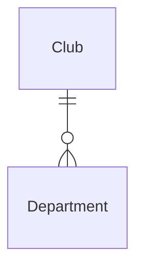

# CONTRIBUTING: An Sportyweb mitwirken

> WORK IN PROGRESS!

&nbsp;

Mit Sportyweb entsteht eine webbasierte Software für Amateursportvereine, die es erlaubt, alle administrativen Tätigkeiten innerhalb einer solchen Organisation effizient und auf integrierte Art und Weise zu erledigen.
Mit dem im Laufe der Zeit immer weiter steigenden Funktionsumfang wächst automatisch auch die Menge an Code, die notwendig ist, um die gewünschten Features abzubilden.

Dieses Dokument soll als Anleitung bei der Mitentwicklung an Sportyweb dienen und verfolgt mehrere Ziele:

**Schneller Einstieg und einfacheres Arbeiten:**

[Elixir](https://elixir-lang.org/) ist eine funktionale Programmiersprache und somit in vielerlei Hinsicht anders, als eher bekannte imperative (Assembler, C, BASIC, ...) oder objektorientierte (Java, Ruby, Python, ...) Programmiersprachen.
Auch das verwendete Framework [Phoenix](https://www.phoenixframework.org/) weicht durch den Einsatz von [LiveView](https://hexdocs.pm/phoenix_live_view/Phoenix.LiveView.html) von etablierten [MVC-Webframeworks](https://de.wikipedia.org/wiki/Model_View_Controller) (Rails, Django, Laravel, ...) ab.
Dieses Dokument wird für komplette Neueinsteiger das Studium entsprechender Fachliteratur und Projektdokumentation nicht ersetzen können, dient aber als Ausgangspunkt zum Verständnis der grundlegenden Zusammenhänge innerhalb der Codebasis und soll so einen schnellen Überblick und Einstieg ermöglichen, sowie die spätere Arbeit vereinfachen.

**Einheitliche und qualitativ hochwertige Codebasis:**

Sportweb steht vor dem (im Vergleich zur Softwareentwicklung in der freiem Wirtschaft) eher ungewöhnlichen Problem, dass in verhältnismäßig kurzer Zeit Menschen mit unterschiedlichstem Kenntnisstand bzgl.
Webentwicklung, Elixir und Phoenix auf eine möglichst einheitliche Wissensebene gebracht werden müssen, um direkt im Anschluss effektiv mitwirken zu können.
Um also die sowieso vorhandene Einstiegshürde nicht noch weiter anzuheben, ist es von äußerster Wichtigkeit, dass die Codebasis von Sportyweb, trotz des kontinuierlich wachsenden Funktionsumfangs, möglichst einheitlich und mit einem hohen Anspruch an Softwarequalität weiterentwickelt wird.
Es gilt also, sich möglichst an die Vorgaben des Frameworks sowie der verwendeten Komponenten zu halten, aber auch die in diesem Dokument festgelegten Prozesse und Best Practices zu beachten.
Nur so kann über einen langen Zeitraum hinweg die [technische Schuld](https://en.wikipedia.org/wiki/Technical_debt) trotz einer großen Zahl von Funktionen und Mitwirkenden auf einem überschaubaren Level gehalten werden.

**Prozesse und Best Practices:**

Auch wenn durch das Phoenix-Framework und Komponenten wie LiveView oder Tailwind bereits viele Best Practices aus dem Bereich der Webapplikationsentwicklung automatisch übernommen wurden, gilt es trotzdem diese mit Bedacht einzuhalten und zu befolgen.
Wie in der Softwareentwicklung üblich, führen viele Wege nach Rom und es ist sehr einfach, aber meist nicht von Vorteil, von bewährten Vorgehensweisen abzuweichen.
Deshalb wird in diesem Dokument klar beschrieben, wie bei der Erstellung neuer und der Anpassung bestehender Elemente vorgegangen werden soll.<br>
Dies umfasst die Nutzung des Phoenix Codegenerators, anschließend notwendige Anpassungen und Erweiterungen der Migrations, Components, Views und Tests, sowie die Erweiterung der Seed-Datei und Dokumentation.
Außerdem wird das Vorgehen bei Commits und Merges in andere Branches aufgezeigt, um eine saubere und möglichst fehlerfreie Codebasis zu gewährleisten.

Begründete Abweichungen von den nachfolgend geschilderten Abläufen sind natürlich nicht verboten, sollten aber eher die Ausnahme bleiben.

&nbsp;

> Hinweise:
> - Die Erklärungen in diesem Dokument sollen nicht zu spezifisch sein, dafür existiert ausreichend Fachliteratur und (meist wesentlich aktuellere) Projektdokumentation. Stattdessen sollen allgemeine Zusammenhänge verständlich gemacht und Sportyweb-spezifische Softwaredesign-Entscheidungen nachvollziehbar erklärt werden.
> - Alle Sätze in der Markdown-Datei beginnen in einer neuen Zeile, um Änderungen daran besser nachvollziehen zu können. Dargestellt werden dann aber, wie bei HTML im Browser, zusammenhängende Absätze.

&nbsp;

# Entwicklungsumgebung aufsetzen

Um an Sportyweb mitzuwirken, muss das Projekt auf dem lokalen System zum Laufen gebracht werden.
Dafür notwendig sind die Programmiersprachen Erlang und Elixir (Elixir basiert auf Erlang, deshalb diese Abhängigkeit), sowie das Datenbanksystem PostgreSQL.
Eine Installationsanleitung mit der Angabe der jeweils notwendigen Version ist in der [README](https://gitlab.com/fuhevis/sportyweb/-/blob/development/README.md)-Datei zu finden, wobei spezifische Unterschiede bzgl.
des eingesetzten Betriebssystems zu beachten sind.

Die notwendigen Informationen zur Konfiguration der PostgreSQL-Datenbank für die Entwicklungsumgebung sind ebenfalls in der README, aber auch in folgender Datei hinterlegt: <https://gitlab.com/fuhevis/sportyweb/-/blob/development/config/dev.exs>

Außerdem notwendig sind die Installation und Konfiguration von Git und GPG, um verifizierte Commits zu erstellen.
Auch hier ist die entsprechende Anleitung der README-Datei zu entnehmen.

Das Sportyweb-Projekt kann mit `git clone` in einen beliebigen Unterordner auf dem eigenen System gepackt werden:

```bash
git clone git@gitlab.com:fuhevis/sportyweb.git
```

Im Stammverzeichnis des Projekts befindet sich das [setup-dev-env.sh](https://gitlab.com/fuhevis/sportyweb/-/blob/development/setup-dev-env.sh) Skript.
Wird dieses ausgeführt (Anleitung hierzu in der Datei selbst), installiert es automatisch alle für Sportyweb notwendigen Abhängigkeiten, kümmert sich um das korrekte Setup der Datenbank und initialisiert diese mit ersten Beispieldaten aus der [seed.exs](https://gitlab.com/fuhevis/sportyweb/-/blob/development/priv/repo/seeds.exs)-Datei.
Außerdem erzeugt es dynamisch die aktuellste Version der Projektdokumentation, sowie ein Entity Relationship Diagram der Datenbank.

```bash
./setup-dev-env.sh
```

Läuft das Skript vollständig durch und quittiert seinen Dienst mit „Done“, kann davon ausgegangen werden, dass die Installation und Konfiguration von Erlang, Elixir und PostgreSQL erfolgreich war.

Nun lässt sich mit folgendem Befehl der lokale Server starten, im Anschluss ist die Applikation unter <http://localhost:4000> erreichbar.

```bash
mix phx.server
```

&nbsp;

## Generator (LiveView)

Um zu vermeiden, dass jede Zeile Code von Hand geschrieben werden muss, bietet Phoenix die Möglichkeit, Code-Generatoren zu verwenden.
Diese helfen bei der Erstellung neuer Entitäten und erzeugen automatisch Ordner und Dateien, welche den aktuellsten Konventionen des Frameworks entsprechen und die grundlegenden [CRUD](https://de.wikipedia.org/wiki/CRUD)-Operationen direkt im Code abbilden.
Die Nutzung der Generatoren wird dringend empfohlen, da davon auszugehen ist, dass der so erzeugte Output im Vergleich zur manuellen und wesentlich zeitaufwändigeren Erstellung einheitlicher und weniger fehleranfällig ausfällt.

**Zur Anpassung von Code bestehender Entitäten sind die Generatoren nicht geeignet, weshalb in solchen Fällen dieses Kapitel übersprungen werden kann.**

Für Sportyweb wurde die Entscheidung getroffen, durchgängig auf [Phoenix LiveViews](https://github.com/phoenixframework/phoenix_live_view) zu setzen, für die ein eigener, integrierter [Generator](https://hexdocs.pm/phoenix/Mix.Tasks.Phx.Gen.Live.html) existiert.
Dieser erzeugt neben den LiveViews auch noch die notwendigen Templates, sowie den Context, oder erweitern diesen, falls er bereits existiert.

Als einführendes Beispiel soll eine vereinfachte Variante der Abteilungen erzeugt und in den nachfolgenden Kapiteln angepasst/erweitert werden.
Hinweis: Da die Abteilungen in Sportweb selbst bereits (in umfangreicherer Form) existieren, würde das nochmalige Ausführen des Generators zu Fehlern führen!

Das minimalistische Entity Relationship Diagram:



Ein Club (Verein) kann beliebig viele Departments (Abteilungen) haben, aber ein Department gehört immer zu genau einem Club.
Die Club-Entität existiert im (fiktiven) Beispiel bereits, die Departments sollen neu hinzukommen.

Die Phoenix-Generatoren sind Mix-Tasks und somit über die Kommandozeile zu nutzen.
Für das Department-Beispiel sieht der Aufruf des LiveView-Generators (`mix phx.gen.live`) so aus:

```bash
mix phx.gen.live Organization Department departments \
  club_id:references:clubs \
  name:string \
  --binary-id
```

Es wird eine neue Entität mit dem Namen „ Department“ (Singular verwenden!) erzeugt, welche - wie auch schon die Clubs - dem Context „Organization“ (Singular verwenden!) zugeordnet wird.
„departments“ definiert den zu verwendenden Plural des Entitätsnamens und auch die Datenbank-Tabelle wird so heißen.
Das Attribut „club_id“ wird als als Foreign Key auf einen bestimmten Club in der „clubs“-Tabelle (Spalte „id“) referenzieren.
Das Attribut „name“ ist vom Typ String, weitere Datentypen sind in der [Schema-Dokumentation](https://hexdocs.pm/phoenix/Mix.Tasks.Phx.Gen.Schema.html#module-attributes) zu finden.
Das Flag „[--binary-id](https://hexdocs.pm/phoenix/Mix.Tasks.Phx.Gen.Schema.html#module-binary_id)“ gibt an, dass als ID für die Departments keine aufsteigende Integer-Zahl verwendet werden soll, sondern eine wesentlich umfangreiche und schwer zu erratende Zahlen-/Buchstaben-Kombination.

Da der „Organization“-Context bereits existiert und von der Club-Entität verwendet wird, kommt es bei der Ausführung des obigen Befehls zu einer Rückfrage, ob der bestehende Context erweitert werden soll.
Dies ist mit „`y`“ (yes) zu bestätigen.

Der Generator erzeugt im Anschluss eine Vielzahl unterschiedlicher Dateien:

```
* creating lib/sportyweb_web/live/department_live/show.ex
* creating lib/sportyweb_web/live/department_live/index.ex
* creating lib/sportyweb_web/live/department_live/form_component.ex
* creating lib/sportyweb_web/live/department_live/index.html.heex
* creating lib/sportyweb_web/live/department_live/show.html.heex
```

Hierbei handelt es sich um die LiveViews (`.ex`) und die dazugehörigen Templates (`.html.heex`) der neuen Entität.
Die Form Component enthält das Formular (und die dazugehörigen Funktionen) zur Erstellung neuer, und Bearbeitung existierender Daten.
Die Index Component wird in den nachfolgenden Kapiteln stark verändert, da Teile des generierten Codes in eine neu anzulegende, separate Component überführt werden müssen, um mit eigenständigen Views, statt den standardmäßig erzeugten Modals arbeiten zu können.

Weitere Details in den Kapiteln [Live Components](#live-components) und [Heex-Templates](#heex-templates).

```
* creating test/sportyweb_web/live/department_live_test.exs
```

Enthält vorgefertigte Test-Cases für die unterschiedlichen LiveViews und deren (erwartetes) Verhalten.

Weitere Details im [Tests](#tests)-Kapitel.

```
* creating lib/sportyweb/organization/department.ex
```

In dieser Datei ist das [Schema](https://hexdocs.pm/ecto/Ecto.Schema.html) zu finden, welches den Aufbau und die Attribute der Entität definiert.
Das Schema wird vorrangig dazu verwendet, die Daten aus Datenbank auf Elixir-Structs (die von Phoenix verwendet werden) zu mappen - und umgekehrt.

Außerdem sind dort ein oder mehrere [Changesets](https://hexdocs.pm/ecto/Ecto.Changeset.html) hinterlegt, die bei der Erstellung und Bearbeitung von Daten z.B.
dafür sorgen, dass vor dem Abspeichern eine Validierung der einzelnen Attribute stattfindet und festgelegte Bedingungen einhalten werden.

Weitere Details im [Schema & Changesets](#schema-changesets)-Kapitel.

```
* creating priv/repo/migrations/20230101093000_create_departments.exs
```

Die [Migration](https://hexdocs.pm/ecto_sql/Ecto.Migration.html)-Datei enthält die durch das Hinzukommen der neuen Entität notwendigen Anpassungen an der Datenbank.

Weitere Details im [Migration](#migration)-Kapitel.

```
* injecting lib/sportyweb/organization.ex
* injecting test/sportyweb/organization_test.exs
* injecting test/support/fixtures/organization_fixtures.ex
```

Neben der Erzeugung neuer Dateien, nimmt der Generator auch Änderungen an bestehenden vor.
Dies betrifft die Context-Dateien.
`organization.ex` definiert den „Organization“-Context und enthält in erster Linie Funktionen zur Abfrage, Erzeugung, Aktualisierung und Löschung von Daten aus der Datenbank.
`organization_test.exs` enthält die den „Organization“-Context betreffenden Test-Cases und in `organization_fixtures.ex` sind Fixtures für alle Entitäten definiert, die Teil dieses Contexts sind.

Weitere Details in den Kapiteln [Context](#context) und [Tests](#tests).

Nachdem der Generator die beschriebenen Dateien erzeugt hat, bittet er noch um die manuelle Erweiterung der [router.ex](https://gitlab.com/fuhevis/sportyweb/-/blob/development/lib/sportyweb_web/router.ex)-Datei:

```bash
Add the live routes to your browser scope in lib/sportyweb_web/router.ex:

    live "/departments", Department.Live.Index, :index
    live "/departments/new", Department.Live.Index, :new
    live "/departments/:id/edit", Department.Live.Index, :edit

    live "/departments/:id", Department.Live.Show, :show
    live "/departments/:id/show/edit", Department.Live.Show, :edit
```

Die fünf angegebenen Routes sind zunächst ohne Anpassungen innerhalb des Bereich `scope "/"`, `live_session :require_authenticated_user` zu ergänzen.

Weitere Details im [Router](#router)-Kapitel.

Wenn bei der anschließenden Ausführung des `setup-dev-env.sh` Skripts keine Fehler auftreten und sich auch der lokale Server starten lässt, hat die Erzeugung geklappt.

```bash
./setup-dev-env.sh
mix phx.server
```

Es ist empfehlenswert, nun alle bisherigen Veränderungen als neuen Commit im persönlichen Branch zu hinterlegen.
So entsteht ein klarer, funktionierender Startpunkt an den jederzeit zurückgekehrt oder mit dem verglichen werden kann, wenn durch nachfolgenden Änderungen Probleme auftreten sollten.

&nbsp;

## Router (LiveView)

In der [router.ex](https://gitlab.com/fuhevis/sportyweb/-/blob/development/lib/sportyweb_web/router.ex)-Datei werden die von der Applikation zur Verfügung gestellten Endpunkte definiert und mit Components und deren Funktionen verknüpft.
Jede dieser Route-Definitionen besteht dabei aus mehreren Teilen, auf die nachfolgend genauer eingegangen werden soll.

Grundlegend wichtig für das Verständnis dieses Kapitels ist, dass durch den Einsatz von [LiveViews](https://hexdocs.pm/phoenix_live_view/Phoenix.LiveView.html) die Route-Definitionen, anders als bei einem „klassischen“ Phoenix-Projekt, nicht mit einem der bekannten [HTTP-Verben](https://en.wikipedia.org/wiki/Representational_state_transfer) (`get`, `post`, `put`, `patch`, `delete`, ...) beginnen, sondern mit `live`.
Deshalb sind Teile des [Phoenix Routing-Guides](https://hexdocs.pm/phoenix/routing.html) und die [Phoenix Router-Dokumentation](https://hexdocs.pm/phoenix/Phoenix.Router.html) weniger hilfreich, als die in erster Linie zu verwendende [LiveView Router-Dokumentation](https://hexdocs.pm/phoenix_live_view/Phoenix.LiveView.Router.html).

Im vorherigen Kapitel wurden die vom Generator automatisch erzeugten Standard-Routes manuell von der Konsole in die router.ex-Datei übertragen.
Diese Routes passen zu den neu angelegten Components und ihren Funktionen, sollen nun aber (als erster Schritt eines umfangreicheren Umbaus) verändert werden.<br>
Der Grund: Standardmäßig erzeugt der Generator mehrere Modals und den dazu passenden Code zum Erstellen und Bearbeiten von Entitäten.
Für Sportyweb wurde allerdings die Entscheidung getroffen, auf Modals zu verzichten und stattdessen zwei eigenständige Views (mit jeweils eigenem Endpunkt) zum Erstellen und Bearbeiten anzulegen.
Dies hat mehrere Vorteile:

- Klar definierte Endpunkte für diese Views ermöglichen es, von einem beliebigen Punkt aus darauf zu verlinken.
- Der zur Verfügung stehende Platz wird vollständig genutzt und auch umfangreichere Formulare sind kein Problem.
- Ein versehentliches Schließen des Modals mit gleichzeitigem Verlust aller bisherigen Eingaben ist ausgeschlossen.
- Zwei eigenständige Views sind wesentlich einfacher zu testen, als an verschiedensten Stellen eingesetzte Modals.

Die Department-Routes sollen von nun an also folgendermaßen aussehen:

```elixir
live "/departments", DepartmentLive.Index, :index_root
live "/clubs/:club_id/departments", DepartmentLive.Index, :index

live "/clubs/:club_id/departments/new", DepartmentLive.NewEdit, :new
live "/departments/:id/edit", DepartmentLive.NewEdit, :edit

live "/departments/:id", DepartmentLive.Show, :show
```

Unter der `"/departments"`-Route werden standardmäßig alle in der Datenbank abgelegten Departments aufgelistet.
Dies ist nicht mehr länger notwendig/erwünscht, weshalb für diesen Endpunkt in der `DepartmentLive.Index`-Component eine neue Funktion anlegt wurde, welche durch das übergebene `:index_root`-Atom via Pattern Matching aufgerufen wird.
Die Funktion selbst führt eine Weiterleitung aus.

Statt alle verfügbaren Departments zu listen, sollen stattdessen nur jene angezeigt werden, die einem bestimmten Club angehören.
Dafür wird die `"/clubs/:club_id/departments"`-Route definiert, welche mit `:club_id` einen Parameter enthält.
Auf Basis der in der späteren URL konkret angegebenen `club_id` wird der entsprechende Club, inklusive der zu ihm gehörenden Departments aus der Datenbank geladen und diese im Anschluss gelistet.

Departments sollen nur angelegt werden können, indem sie direkt einem bestimmten Club zugeordnet werden.
Deshalb enthält schon die Route zum Erstellungsformular die `club_id` als Parameter: `"/clubs/:club_id/departments/new"`.
So wird vermieden, dass es Departments gibt, die ohne Referenz zu einem Club „in der Luft hängen“.

Um bestehende Abteilungen zu bearbeiten, ist nur noch die Angabe der ID des Departments relevant.
Die Route zum Bearbeitungsformular sieht dementsprechend so aus: `"/departments/:id/edit"`

Die Route `"/departments/:id"` bleibt unverändert bestehen und zeigt das Department mit der entsprechenden ID an.

Soweit die Einführung zum Routing, auf die dazugehörigen Teilbereiche „[Scopes](https://hexdocs.pm/phoenix/routing.html#scoped-routes)“ und „[Pipelines](https://hexdocs.pm/phoenix/routing.html#pipelines)“ soll hier nicht weiter eingegangen werden, ausführliche Informationen finden sich im verlinkten Guide.

&nbsp;

## Migration

TODO:

- Erklärung Migrations allgemein (statt Änderungen DB by hand)
- Erstellungsdatum im Dateinamen, Reihenfolge der Ausführung
- Änderung bestehender Migrations, Abweichung vom normalen Vorgehen Production. setup-dev-env.sh
- Sicherstellung der Integrität: Error auf DB-Ebene, deshalb nachfolgend im Schema zusätzliche Validierungen
- timestamps()
- null: false
- Defaults
- on_delete
- Index (unique)
- [Migration](https://hexdocs.pm/ecto_sql/Ecto.Migration.html)


&nbsp;

## Schema & Changesets

TODO:

- Relationen: field --> has_one, has_many, belongs_to (on_delete)
- Relationen auf der jeweiligen Gegenseite
- cast
    - Reihenfolge
    - empty_values: []
- validate
    - Link
    - unique (Erklärung)


&nbsp;

## Context

TODO:

- https://hexdocs.pm/phoenix/contexts.html
- Standard-Funktionen / Naming
- Preloads (Ecto)
- https://hexdocs.pm/phoenix/ecto.html


&nbsp;

## Live Components

TODO:

- Warum überhaupt LiveView? Erklärung Nutzung LiveView statt des regulären MVP-Ansatzes
- index_root
- Umbau index (Modals) --> new_edit (Views)
    - Router
    - show.ex
        Löschen:
        defp page_title(:show), do: "Show ..."
        defp page_title(:edit), do: "Edit ..."
    - ...
- assigns
    - Club auf Socket, Navigation Sidebar
    - Breadcrumbs


&nbsp;

## Heex-Templates

TODO:

- Rad nicht neu erfinden, an Vorarbeiten orientieren
- CoreComponents, z.B. Cards
- Umbau index --> new_edit
- Formulare
    - Einheitlichkeit
    - Kompaktheit (Spalten)
    - Anmerkungen / Erklärungen Felder
- Übersetzungen, Einheitlichkeit


&nbsp;

## Seed

TODO:

- Erweiterung um aussagekräftige Beispiele
- Abdecken aller Features
- Hilft allen
- Ausführung via setup-dev-env Skript, oder direkt: ...
    - Mehrfache Ausführung führt zu Validation-Errors

&nbsp;

## Tests

TODO:

- Notwendigkeit
- Genauigkeit / Tiefe
- Hinzufügen / Anpassen
- Fixtures
- asserts
- Zusammenwirken mit Seed


&nbsp;

## Dokumentation

- Notwendigkeit
- Allgemein: Erklärung Entitäten + Attribute des Datenmodells
- Genauigkeit / Tiefe
- Problematik der Aktualität
- Unterscheidung technische Dokumentation und Handbuch für Endnutzer
- Hinzufügen / Anpassen
- Abschlussarbeit (Konzeption, Vorgehensweise, ...)
- Kommentaren für die einzelnen Funktionen
- Tests


&nbsp;

## Vor dem Commit

Vor allem vor dem Merge in den Development-Branch!

TODO:

- setup-dev-env.sh
- Funktioniert Kompilierung?
- Restart server
- Tests: mix test
- Linter: mix credo --all
- git diff
