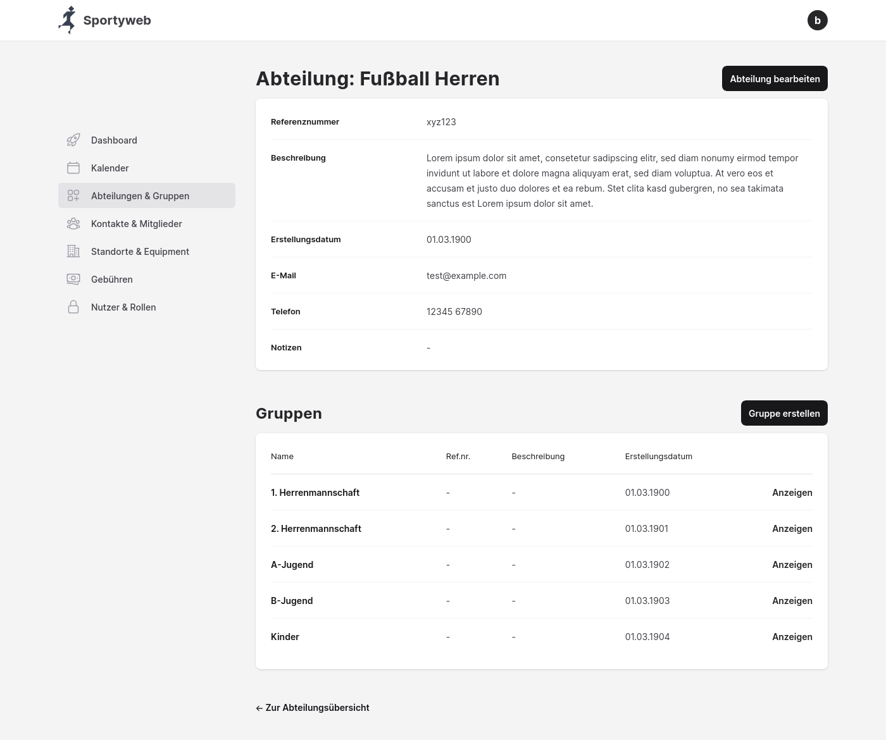

# Sportyweb - A web app for managing sports clubs

Sportyweb is a multitenancy web application for the efficient and collaborative management of sports clubs.
Sportyweb targets a broad range of sports clubs of sizes from large-sized, multi-sports clubs with several thousand members to small, single-sports clubs with a few dozen members.

The integrated open-source-software is currently in its initial development phase and aims to offer digital solutions for all typical club management areas:

- **Club administration:** Management of the core data of clubs
- **Departments & groups:** Mapping of the hierarchical structure of a club, management of department and group members
- **Contacts & memberships:** Management of contacts (members and non-members, persons and organizations), creation and cancellation of memberships
- **Events:** Management of events and calendars, management of participants
- **Locations & equipment:** Management of locations and equipment
- **Rental:** Rental of locations and equipment by members and non-members
- **Fees & subsidies:** Management of various custom fees and subsidies
- **Finance & Accounting:** Bookkeeping, preparation of reports and forecasts, payment processing
- **Documents:** Management of files, (public) sharing, versioning
- **Publications**: Management of newsletters, website and social media content
- **Wiki:** Collaborative knowledge base
- **Projects & Tasks:** Management of projects and tasks
- **Chats:** Instant messaging, group chats
- ...

The listed areas are currently at different stages of their development.

Sportyweb is being developed as part of the [SPORT research project](https://www.fernuni-hagen.de/evis/research/projects/sport.shtml) by the [Information Systems Development Research Group](https://www.fernuni-hagen.de/evis/) at the [FernUniversität in Hagen](https://www.fernuni-hagen.de/), Germany.

The research project examines the domain of clubs, in particular sports clubs, which has so far only been given secondary attention, reflects domain-specific use cases, business processes and requirements, and uses state-of-the-art technologies of modern web development like the programming language [Elixir](https://elixir-lang.org), the web application framework [Phoenix](https://www.phoenixframework.org) and the database management system [PostgreSQL](https://www.postgresql.org).

## Run the prototype

> [!WARNING]
> This project is a work in progress and not yet ready for production ⚡

### Prerequisites

Current versions of:

- git
- Erlang
- Elixir
- PostgreSQL

We recommend using a version manager to install Elixir & Erlang: https://elixir-lang.org/install.html#version-managers

### Start the application

- Install dependencies with `mix deps.get`
- Change the development database name ("sportyweb_dev") if necessary in `sportyweb/config/dev.exs`
- Create and migrate your database with `mix ecto.setup`
- Start Phoenix endpoint with `mix phx.server` or via IEx with `iex -S mix phx.server`

Now you can visit [`localhost:4000`](http://localhost:4000) from your browser.

## Learn more about the tech stack

- **Elixir**
  - Website: https://elixir-lang.org
  - Docs: https://elixir-lang.org/docs.html
  - Source: https://github.com/elixir-lang/elixir
  - Forum: https://elixirforum.com
- **Phoenix**
  - Website: https://www.phoenixframework.org
  - Docs: https://hexdocs.pm/phoenix
  - Source: https://github.com/phoenixframework/phoenix
- **Phoenix LiveView**
  - Docs: https://hexdocs.pm/phoenix_live_view/welcome.html
  - Source: https://github.com/phoenixframework/phoenix_live_view
- **Ecto**
  - Docs: https://hexdocs.pm/ecto/getting-started.html
  - Source: https://github.com/elixir-ecto/ecto
