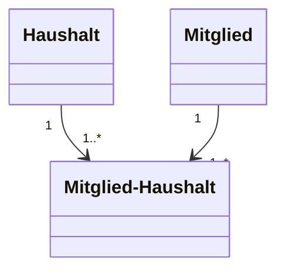

# Database design as class diagram (for using multiplicity constraints) 

Note that data types are NOT properly modeled due to Mermaid.js limitations, see 
https://mermaid-js.github.io/mermaid/#/classDiagram

