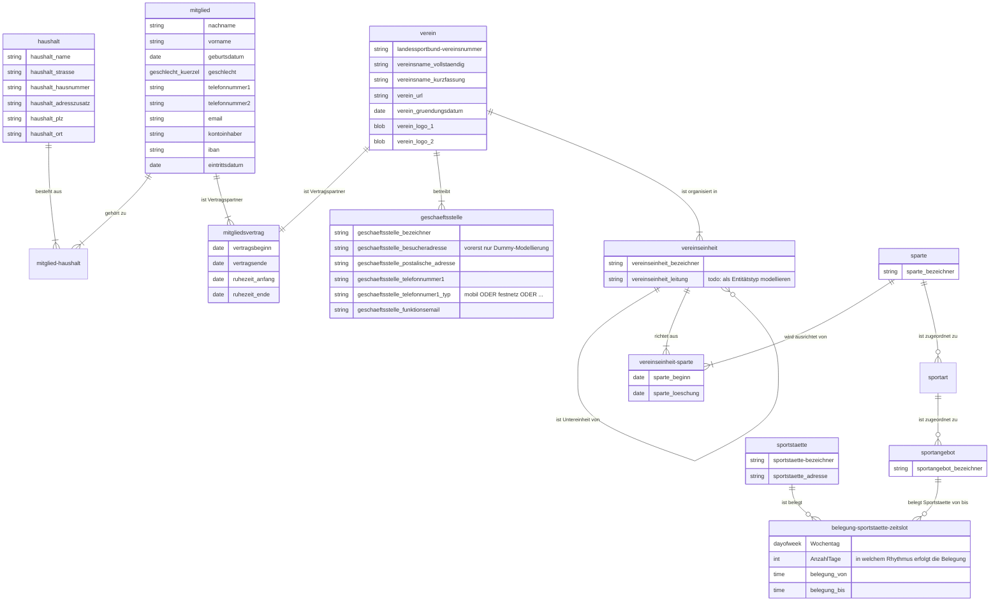

# ER diagram 

Note that data types are NOT properly modeled due to Mermaid.js limitations, see 
https://mermaid-js.github.io/mermaid/#/entityRelationshipDiagram

# Erläuterungen

- Mitglied
  - ein Mitglied ist eine natürliche Person (TODO: Entitätstyp PERSON modellieren)
  - eine Person ist erst durch Abschluss eines Mitgliedsvertrags ein Mitglied

- Haushalt
  - ein Haushalt wird über eine postalische Adresse identifiziert
  - da an einer postalischen Adresse mehrere Haushalte existieren können (Mehrfamilienhäuser),
    ist es erforderlich, einem Haushalt einen eindeutigen Namen (Bezeichner) zu vergeben
  - "Haushalt" ist ein "künstlich eingefügtes" Konzept, mit dem die Zusammenfassung
    von Mitgliedern zu Gruppen ermöglicht wird, z.B. um einen Rabatt auf Mitgliedsbeiträge 
    zu erhalten. Anders als ein starres Konzept wie etwa "Familie" ermöglicht es "Haushalt",
    moderne Formen des Zusammenlebens zu repräsentieren. 
  - Idee hinter dem Konzept "Haushalt" ist, dass jedes Mitglied einem Haushalt angehört, 
    auch wenn der Haushalt nur diese eine Person umfasst, um zeitlich nachgelagert weitere
    Mitglieder einem Haushalt hinzufügen zu können.

- Mitglied-Haushalt
  - ein Mitglied muss mindestens einem Haushalt angehören
  - ein Haushalt muss mindestens ein Mitglied umfassen
  - ein Mitglied kann mehreren Haushalten angehören (auch wenn dies auf den ersten Blick
    ungewöhnlich ist, so ermöglicht dies, moderne Formen menschlichen Zusammenlebens wie
    Erwachsene, die in zwei Haushalten im Wechsel leben, zu repräsentieren) 
  - für ein Neumitglied wird ein Haushalt neu angelegt, sofern ein korrespondierender Haushalt
    noch nicht existiert; andernfalls wird das Neumitglied einem bereits vorliegenden Haushalt
    hinzugefügt.

- Mitgliedsvertrag : ein aktuell gültiger Mitgliedsvertrag ist Grundlage der Vereinsteilnahme
  - ein Mitgliedsvertrag hat formal zwei Vertragspartner : Verein und Mitglied (Person)
  - ein Mitglied muss mindestens einen Mitgliedsvertrag abgeschlossen haben
  - ein Mitglied kann einen Mitgliedsvertrag ohne Vertragsende abschließen und
    lebenslang Mitglied mit diesem Mitgliedsvertrag bleiben
  - ein Mitglied kann im Laufe der Zeit mehrere Mitgliedsverträge abschließen, wenn
    das Mitglied einen früher laufenden Mitgliedsvertrag beendet hat und nach einiger Zeit
    wieder einen Mitgliedsvertrag abschließt
  - ein Mitglied kann temporär einen Mitgliedsvertrag aussetzen (diverse Gründen)
  - diverse weitere Aspekte eines Mitgliedsvertrags sind hier _noch nicht_ modelliert

- Verein : Daten, die den Verein beschreiben
  - dieser Entitätstyp "Verein" ist ein "Singleton" => es gibt nur eine Entität als
    Instanz dieses Entitätstyps
  - Hinweis: Weitere Daten, die einen Verein charakterisieren, sind dem deutschen Vereinsrecht 
    zu entnehmen
  - Hinweis: _Noch nicht modelliert_ sind Vereinsfunktionäre in ihren Rollen (Vorsitzender, 
    Kassenwart etc.) 
  - Hinweis _Noch nicht modelliert_ sind Vereinssatzungen, die u.a. in Bezug auf Mitgliedsverträge
    Relevanz aufweisen. 

- Geschaeftsstelle : eine Geschaeftsstelle wird von einem Verein betrieben
  - ein Verein betreibt eine oder mehrere Geschaeftsstellen
  - eine Geschaeftsstelle hat eine Besucheradresse und eine postalische Adresse sowie
    ein oder mehrere Telefonverbindungen

- Vereinseinheit : ein Verein ist in Organisationseinheiten (z.B. Abteilungen) unterteilt
  - Vereinseinheit ist synonym mit Organisationseinheit (Begriff der Organisationstheorie)
  - ein Verein betreibt mindestens eine Vereinseinheit
  - eine Vereinseinheit ist genau einem Verein zugeordnet (aber: es gibt nur einen Verein)
  - Bsp. für eine Vereinseinheit : Abteilung, Unterabteilung, Unterunterabteilung usw.
  - eine Vereinseinheit kann einer anderen Vereinseinheit untergeordnet sein
  - eine Vereinseinheit kann einer oder keiner übergeordneten Vereinseinheit zugeordnet sein
  - Eine Vereinseinheit verantwortet die Bereitstellung mindestens eines Sportangebots
  - Hinweis: Vereinseinheiten sind in dieser Modellierung bewusst getrennt von Sportangeboten des Vereins 
    gedacht und modelliert.
    Erst durch die nachfolgend skizzierte Datenhaltung zu Sportangeboten und ihrer Systematisierung und
    Strukturierung wird die Beteiligung einer Vereinseinheit an der Ausrichtung von Sportangeboten modelliert!
  - mit anderen Worten: Die Modellierung überlässt es den Vereinsverantwortlichen, mehrere Abteilungsebenen
    anzulegen und zu pflegen _oder_ mit nur einer ("Haupt-") Ebene zu arbeiten.
  - Beispiel 1: Haupt-Abteilung: Fussball - Unterabteilungen: Kinder- und Jugendfussball, Seniorenfussball 
  - Beispiel 2: Haupt-Abteilung: Fussball, Haupt-Abteilung: Basketball, Haupt-Abteilung: Volleyball usw. 
  - (Anmerkung: Die Modellierung erlaubt es auch, zu einem späteren Zeitpunkt neue Vereinseinheiten anzulegen
    und diese anderen Vereinseinheiten unterzuordnen)

- Sparte : eine (Vereins-)Sparte dient der Gruppierung von Sportarten nach Sportvereinswesen-bezogenen Kriterien
  - eine Sparte ist mindestens einer Vereinseinheit (mittels Vereinseinheit-Sparte) zugeordnet
  - eine Sparte kann von mehreren Vereinseinheiten getragen/ausgerichtet werden = 
    mehrere Vereinseinheiten können eine Sparte organisieren und verantworten
  - einer Sparte können mehrere Sportarten zugeordnet sein
  - Beispiele für Sparte: Wassersport, Ballsport, Fitnesssport, Reha-Sport, ...
  - Hinweis: eine Vereinssparte kann einer Vereinseinheit (z.B. Abteilung) entsprechen, muss aber nicht 

- Sportart : eine Sportart dient der Gruppierung von Sportangeboten nach Sportvereinswesen-bezogenen Kriterien
  - für die Systematisierung von Sportarten liegen mehrere Systematiken in den Sportwissenschaften vor,
    darüber hinaus haben sich im Sportvereinswesen Systematiken etabliert
  - Sportart : Fussball, Basketball, Handball, Volleyball, Fitnesssport, Reha-Sport usw. 
  - eine Sportart ist genau einer Sparte zugeordnet (TODO: ggf. eine zu restriktive Einschränkung)

- Sportangebot : ein Sportangebot dient der Datenhaltung zu konkreten Sportangeboten des Vereins
  - "Sportangebot" ist der vorläufig gewählte Begriff für konkrete Einzelangebote des Vereins
  - Beispiel: Jumping Fitness, samstags 10 bis 11 Uhr, Trainer: Marie Mustermann
  - Hinweis zum Beispiel: Das Beispiel "Jumping Fitness" legt offen, dass ein Sportangebot _nur_
    in Zusammenhang mit einer Sportstätten-Belegung und einer Belegungszeit sinnvoll zu interpretieren
    ist.
  - TODO : Sportstätten-Belegung und Belegungszeiten sind _noch nicht_ modelliert!
  - TODO: ggf. ist zusätzlich ein rekursiver Beziehungstyp von Sportangebot zu Sportangebot 
    erforderlich, um Über-Unterordnungsbeziehungen zwischen Sportangeboten repräsentieren zu können;
    dies würde allerdings zu einer deutlich aufwändigeren Programmierung führen

- Sportstätte
  - ein Sportstätte ermöglicht das Durchführen von Sportangeboten
  - Beispiele: Sportstätten können Sporthallen, Teile von Sporthallen, Sportplätze, Laufbahnen, 
                usw. sein
  - ein Sportangebot wird zu einem Zeitslot an einer Sportstätte durchgeführt
  - eine Sportstätte steht zu einem Zeitslot zur Verfügung (Verfügbarkeit)
  - eine Sportstätte kann zu einem Zeitslot "gebucht" / belegt werden

- Belegung-Sportstaette-Zeitslot
  - An welchem Wochentag oder Datum ist eine Sportstätte von wann bis wann durch welches Sportangebot belegt?
  - Hinweis: _Noch nicht final modelliert_
