# ER Overview Diagram 

# ER Details Diagram 

Note that data types are NOT properly modeled due to Mermaid.js limitations, see 
https://mermaid-js.github.io/mermaid/#/entityRelationshipDiagram

```mermaid
erDiagram

          person ||--o| mitglied : "ist eine"
          person ||--o| trainer : "ist eine"
          haushalt ||--|{ mitglied-haushalt : "besteht aus"
          mitglied ||--|{ mitglied-haushalt : "gehört zu"
          mitglied ||--|{ mitgliedsvertrag : "schliesst ab"
          beitragsgruppe ||--|{ mitgliedsvertrag : "ist zugeordnet"
          verein ||--|{ geschaeftsstelle : "betreibt"
          verein ||--|{ vereinseinheit : "ist organisiert in"
          vereinseinheit ||--o{ vereinseinheit : "ist Untereinheit von"
          vereinseinheit ||--|{ vereinseinheit-sparte : "richtet aus"
          vereinseinheit ||--|{ mitgliedschaft_vereinseinheit : "ist Mitglied in"
          mitgliedsvertrag ||--o{ mitgliedschaft_vereinseinheit : "ist Mitglied in"
          sparte ||--|{ vereinseinheit-sparte : "wird ausrichtet von"
          sparte ||--o{ sportart : "ist zugeordnet zu"
          sportart ||--o{ sportangebotstyp : "ist zugeordnet zu"
          sportangebotstyp ||--o{ konkretes_sportangebot : "wird konkret angeboten"
          sportstaette ||--o{ konkretes_sportangebot : "ist belegt"
          trainer ||--o{ trainer_lizenz : "hat erworben"
          lizenz ||--o{ trainer_lizenz : "nachgewiesen von"
          trainer ||--o{ sportangebotstyp : "ist qualifiziert für"
          trainer ||--|{ konkretes_sportangebot : "führt durch"

          person {
            string person_nachname
            string person_vorname
            date person_geburtsdatum
            geschlecht_kuerzel person_geschlecht
            string person_email1
            string person_email2
            string person_telefonnummer1
            string person_telefonnummer2            
            text person_notiz1
            text person_notiz2
          }

          mitglied {
            date mitglied_eintrittsdatum 
            string mitglied_kontoinhaber
            string mitglied_iban
            zahlungsweise mitglied_zahlungsweise "bar | Abbuchung | ???"
            zahlungsrhythmus mitglied_zahlungsrhythmus "monatlich | quartalsweise | halbjährlich | jährlich"
            text mitglied_notiz1
            text mitglied_notiz2
            date mitglied_letzter_kontakt
            string mitglied_kontakt_art "email OR telephone OR in person"
          }

          haushalt {
            string haushalt_name
            string haushalt_strasse
            string haushalt_hausnummer
            string haushalt_adresszusatz
            string haushalt_plz
            string haushalt_ort
          }

          mitgliedsvertrag {
            date mitgliedsvertrag_aufnahmedatum
            date mitgliedsvertrag_kuendigungsdatum
            date mitgliedsvertrag_ruhezeit_anfang
            date mitgliedsvertrag_ruhezeit_ende
          }

          beitragsgruppe {
            money beitragsgruppe_jahresgrundgebuehr
            string beitragsgruppe_bezeichner
            string beitragsgruppe_beschreibung
            boolean beitragsgruppe_nachweis_erforderlich
            date beitragsgruppe_gueltig_von
            date beitragsgruppe_gueltig_bis
          }

          vereinseinheit ||--o{ zusatzbeitrag : "erhoben für"
          beitragsgruppe ||--|{ zusatzbeitrag : "erhoben in"

          zusatzbeitrag {
            money zusatzbeitrag_jahreszusatzbeitrag
            string zusatzbeitrag_bezeichner
            string zusatzbeitrag_beschreibung
            date zusatzbeitrag_gueltig_von
            date zusatzbeitrag_gueltig_bis
          }

          mitgliedschaft_vereinseinheit {
            date mitgliedschaft_datum_beginn
            date mitgliedschaft_datum_ende
            money mitgliedschaft_gebuehr
          }

          verein {
            string landessportbund-vereinskennziffer
            string vereinsname_vollstaendig
            string vereinsname_kurzfassung
            string verein_url
            date verein_gruendungsdatum
            blob verein_logo_1
            blob verein_logo_2
          }

          geschaeftsstelle {
            string geschaeftsstelle_bezeichner
            string geschaeftsstelle_besucheradresse "vorerst nur Dummy-Modellierung"
            string geschaeftsstelle_postalische_adresse
            string geschaeftsstelle_telefonnummer1
            string geschaeftsstelle_telefonnumer1_typ "mobil ODER festnetz ODER ..."
            string geschaeftsstelle_funktionsemail
          }

          vereinseinheit {
            string vereinseinheit_bezeichner
            string vereinseinheit_leitung "todo: als Entitätstyp modellieren"
          }

          vereinseinheit-sparte {
            date sparte_beginn
            date sparte_loeschung
          }

          sparte {
            string sparte_bezeichner
            string sparte_erlaeuterung "Erläuterung der Spartendefinition"
            date spart_einfuehrungsdatum
          }

          sportart {
            string sportart_bezeichner
          }

          sportangebotstyp {
            string sportangebotstyp_bezeichner
            date sportangebotstyp_einfuehrungsdatum
            date sportangebotstyp_beendigungsdatum
          }

          sportstaette {
            string sportstaette-bezeichner
            string sportstaette_adresse
            int sportstaette_teilnehmer_kapazitaet
          }

          konkretes_sportangebot {
            dayofweek Wochentag
            date belegung_termin "alternativ zu dayofweek Wochentag"
            int AnzahlTage "in welchem Rhythmus erfolgt die Belegung"
            time belegung_von
            time belegung_bis "u.a. CONSTRAINT belegung_von < belegung_bis"
            int min_teilnehmer
            int max_teilnehmer
          }

          trainer {
            string spitzname
            string kontoinhaber
            string iban
          } 

          lizenz {
            string lizenz_bezeichner
            string lizenz_beschreibung
            string lizenz_ausstellender_verband "TODO: normalisieren"
            string lizenz_erfasst_von
          }

          trainer_lizenz {
            date lizenz_erworben_am
            date lizenz_gueltig_bis
            string lizenz_erworben_bei
            boolean lizenz_ueberprueft
            blob lizenz_scan
          }

```

# Erläuterungen

- Person : eine natürliche Person
  - die Normalisierung der Datenhaltung legt das Modellieren organisationaler Rollen wie Mitglied, Mitarbeiter, Trainer 
    Funktionär, Sponsor usw. mittels einer Relation PERSON nahe
  - eine Person kann gleichzeitig mehrere organisationale Rollen ausfüllen   
  - Beispiel : eine Person kann gleichzeitig Mitglied, Mitarbeiter, Trainer und Funktionär sein
  - eine Person kann auch *keine* organisationale Rolle im Verein ausfüllen
  - Beispiel : eine Person kann eine Vereinskontaktperson sein, deren Kontaktdaten erfasst werden sollen,
    z.B. eine Kontaktperson in einem Verband oder im Stadtsportbund usw. 
  - TODO : _noch nicht final modelliert_

- Mitglied
  - ein Mitglied ist eine natürliche Person
  - eine Person ist erst durch Abschluss eines Mitgliedsvertrags ein Mitglied
  - ein Mitglied hinterlegt Bankverbindung und Zahlungsweise und Zahlungsrhythmus

- Haushalt
  - ein Haushalt wird über eine postalische Adresse identifiziert
  - da an einer postalischen Adresse mehrere Haushalte existieren können (Mehrfamilienhäuser),
    ist es erforderlich, einem Haushalt einen eindeutigen Namen (Bezeichner) zu vergeben
  - "Haushalt" ist ein "künstlich eingefügtes" Konzept, mit dem die Zusammenfassung
    von Mitgliedern zu Gruppen ermöglicht wird, z.B. um einen Rabatt auf Mitgliedsbeiträge 
    zu erhalten. Anders als ein starres Konzept wie etwa "Familie" ermöglicht es "Haushalt",
    moderne Formen des Zusammenlebens zu repräsentieren. 
  - Idee hinter dem Konzept "Haushalt" ist, dass jedes Mitglied einem Haushalt angehört, 
    auch wenn der Haushalt nur diese eine Person umfasst, um zeitlich nachgelagert weitere
    Mitglieder einem Haushalt hinzufügen zu können.

- Mitglied-Haushalt
  - ein Mitglied muss mindestens einem Haushalt angehören
  - ein Haushalt muss mindestens ein Mitglied umfassen
  - ein Mitglied kann mehreren Haushalten angehören (auch wenn dies auf den ersten Blick
    ungewöhnlich ist, so ermöglicht dies, moderne Formen menschlichen Zusammenlebens wie
    Erwachsene, die in zwei Haushalten im Wechsel leben, zu repräsentieren) 
  - für ein Neumitglied wird ein Haushalt neu angelegt, sofern ein korrespondierender Haushalt
    noch nicht existiert; andernfalls wird das Neumitglied einem bereits vorliegenden Haushalt
    hinzugefügt.

- Mitgliedsvertrag : ein aktuell gültiger Mitgliedsvertrag ist Grundlage der Vereinsteilnahme, siehe
  https://www.rkpn.de/vereinsrecht/veroeffentlichungen/die-aufnahme-neuer-mitglieder-in-den-verein.html
  - ein Mitgliedsvertrag hat formal zwei Vertragspartner : Verein und Mitglied (Person)
  - ein Mitglied muss mindestens einen Mitgliedsvertrag abgeschlossen haben
  - ein Mitglied kann einen Mitgliedsvertrag ohne Vertragsende abschließen und
    lebenslang Mitglied mit diesem Mitgliedsvertrag bleiben
  - ein Mitglied kann im Laufe der Zeit mehrere Mitgliedsverträge abschließen, wenn
    das Mitglied einen früher laufenden Mitgliedsvertrag beendet hat und nach einiger Zeit
    wieder einen Mitgliedsvertrag abschließt
  - Ruhezeiten: ein Mitglied kann mehrmals temporär einen Mitgliedsvertrag aussetzen (diverse Gründen)
  - diverse weitere Aspekte eines Mitgliedsvertrags sind hier _noch nicht_ modelliert

- Vereinseinheit : ein Verein ist in Organisationseinheiten (z.B. Abteilungen) unterteilt
  - Vereinseinheit ist synonym mit Organisationseinheit (Begriff der Organisationstheorie)
  - ein Verein betreibt mindestens eine Vereinseinheit
  - eine Vereinseinheit ist genau einem Verein zugeordnet (aber: es gibt nur einen Verein)
  - Bsp. für eine Vereinseinheit : Abteilung, Unterabteilung, Unterunterabteilung usw.
  - eine Vereinseinheit kann einer anderen Vereinseinheit untergeordnet sein
  - eine Vereinseinheit kann einer oder keiner übergeordneten Vereinseinheit zugeordnet sein
  - Eine Vereinseinheit verantwortet die Bereitstellung mindestens eines Sportangebots
  - Hinweis: Vereinseinheiten sind in dieser Modellierung bewusst getrennt von Sportangeboten des Vereins 
    gedacht und modelliert.
    Erst durch die nachfolgend skizzierte Datenhaltung zu Sportangeboten und ihrer Systematisierung und
    Strukturierung wird die Beteiligung einer Vereinseinheit an der Ausrichtung von Sportangeboten modelliert!
  - mit anderen Worten: Die Modellierung überlässt es den Vereinsverantwortlichen, mehrere Abteilungsebenen
    anzulegen und zu pflegen _oder_ mit nur einer ("Haupt-") Ebene zu arbeiten.
  - Beispiel 1: Haupt-Abteilung: Fussball - Unterabteilungen: Kinder- und Jugendfussball, Seniorenfussball 
  - Beispiel 2: Haupt-Abteilung: Fussball, Haupt-Abteilung: Basketball, Haupt-Abteilung: Volleyball usw. 
  - (Anmerkung: Die Modellierung erlaubt es auch, zu einem späteren Zeitpunkt neue Vereinseinheiten anzulegen
    und diese anderen Vereinseinheiten unterzuordnen)

- Mitgliedschaft_Vereinseinheit 
  - ein Mitgliedsvertrag kann Einzelposten umfassen, die sich auf die Mitgliedschaft in einer
    Vereinseinheit (z.B. einer Abteilung) umfassen

- Sparte : eine (Vereins-)Sparte dient der Gruppierung von Sport*arten* nach Sportvereinswesen-bezogenen Kriterien
  - eine Sparte ist mindestens einer Vereinseinheit (mittels Vereinseinheit-Sparte) zugeordnet
  - eine Sparte kann von mehreren Vereinseinheiten getragen/ausgerichtet werden = 
    mehrere Vereinseinheiten können eine Sparte organisieren und verantworten
  - einer Sparte können mehrere Sportarten zugeordnet sein
  - einer Sparte sind in der Regel mehrere Sportangebote zugeordnet
  - Beispiele für Sparte: Wassersport, Ballsport, Fitnesssport, Reha-Sport, ...
  - Hinweis: eine Vereinssparte kann einer Vereinseinheit (z.B. Abteilung) entsprechen, muss aber nicht 
  - TODO: Etablierte Vereinssparten-/Vereinsportarten-Systematiken identifizieren!

- Sportart : eine Sportart dient der Gruppierung von Sport*angeboten* nach Sportvereinswesen-bezogenen Kriterien
  - für die Systematisierung von Sportarten liegen mehrere Systematiken in den Sportwissenschaften vor,
    darüber hinaus haben sich im Sportvereinswesen Systematiken etabliert
  - Sportart : Fussball, Basketball, Handball, Volleyball, Fitnesssport, Reha-Sport usw. 
  - eine Sportart ist genau einer Sparte zugeordnet (TODO: ggf. eine zu restriktive Einschränkung)

- Sportangebotstyp : ein Sportangebotstyp dient der Datenhaltung zu Typen von Sportangeboten des Vereins
  - "Sportangebotstyp" ist der vorläufig gewählte Begriff für typisierte Einzelangebote des Vereins
  - Beispiel: Jumping Fitness, Basketball U14

- konkretes_Sportangebot : ein konkretes Sportangebot bedingt die Belegung einer Sportstätte in einem konkreten Zeitslot an einem Wochentag (oder einem konkreten Datum) unter Leitung eines bestimmten Trainers
  - M.a.W.: An welchem Wochentag oder Datum ist eine Sportstätte von wann bis wann durch welches konkrete Sportangebot belegt?
  - Beispiel: Jumping Fitness mit Marie, samstags 11 bis 12 Uhr, Fitnessraum 2+3
  - Hinweis zum Beispiel: Das Beispiel "Jumping Fitness" legt offen, dass ein Sportangebot _nur_
    in Zusammenhang mit einer Sportstätten-Belegung und einer Belegungszeit und einer Person in
    der Rolle Trainer / Übungsleiter (ÜL) sinnvoll zu modellieren ist.
  - TODO: Postgres Range Type tsrange for time ranges, https://www.postgresql.org/docs/14/rangetypes.html 
  

- Sportstätte : ein Sportstätte ermöglicht das Durchführen von Sportangeboten
  - Sportstätten können Sporthallen, Teile von Sporthallen, Sportplätze, Laufbahnen, 
    Schwimmbahnen, Fitnessräume usw. sein
  - eine Sportstätte steht zu einem Zeitslot zur Verfügung (Verfügbarkeit)
  - eine Sportstätte kann zu einem Zeitslot "gebucht" / belegt werden
  - ein Sportangebot wird zu einem Zeitslot an einer Sportstätte durchgeführt

- Trainer : ein Trainer, der für bestimmte Sportangebote qualifiziert ist und bestimmte Sportangebote durchführt 
  - ein Synonym für Trainer ist Übungsleiter (ÜL) - der Begriff 'Trainer' wird hier verwendet, da kürzer und kein Umlaut
  - 'Trainer' ist ein Rolle einer Person
  - ein Trainer ist eine natürliche Person

- Trainer_Trainerlizenztyp : keine, eine oder mehrere Lizenzen, die ein Trainer erworben hat
  - ein Trainer kann keine, eine oder mehrere Lizenzen erworben haben
  - Hinweis: für bestimmte Sportangebote ist keine Trainerlizenz erforderlich
  - eine Lizenz hat üblicherweise eine bestimmte zeitliche Gültigkeit und muss danach durch Teilnahme an
    Trainerweiterbildungen erneuert werden

- Trainerlizenztyp : eine Lizenztyp, die von einem Verband o.ä. geprüft und ausgestellt wird
  - zum Zweck der Wiederverwendung bereits angelegter Lizenzen modelliert
  - Beispiel: C-Lizenz Breitensport

- Beitragsgruppe : eine Beitragsgruppe, die eine Gebührenstruktur für einen Zeitraum definiert 
  - Beispiel: Vollzahler, Schüler/Studenten/Rentner, ...

- Zusatzbeitrag
  - ein Zusatzbeitrag für eine Mitglieschaft in einer Vereinseinheit

- Verein : Daten, die den Verein beschreiben
  - dieser Entitätstyp "Verein" ist ein "Singleton" => es gibt nur eine Entität als
    Instanz dieses Entitätstyps
  - Hinweis: Weitere Daten, die einen Verein charakterisieren, sind dem deutschen Vereinsrecht 
    zu entnehmen
  - Hinweis: _Noch nicht modelliert_ sind Vereinsfunktionäre in ihren Rollen (Vorsitzender, 
    Kassenwart etc.) 
  - Hinweis _Noch nicht modelliert_ sind Vereinssatzungen, die u.a. in Bezug auf Mitgliedsverträge
    Relevanz aufweisen. 

- Geschaeftsstelle : eine Geschaeftsstelle wird von einem Verein betrieben
  - ein Verein betreibt eine oder mehrere Geschaeftsstellen
  - eine Geschaeftsstelle hat eine Besucheradresse und eine postalische Adresse sowie
    ein oder mehrere Telefonverbindungen

# Wichtige Überlegungen zum Datenbankdesign

1. Multi-Tenancy : Derzeit ignoriert das DB-Design die fachliche Anforderung, ein Laufzeitsystem für mehrere, potenziell sehr viele Vereine zu konzipieren und zu implementieren ("multi-tenancy" = mehrere Tenants) 
2. DB-Security : Nicht berücksichtigt ist die Anforderung, Daten *vor* dem Persistieren in der DB zu verschlüsseln und das physische DB-Design nach aktuellen Maßstäben sicher zu gestalten und zu implementieren (u.a. Verwendung nicht-sequentieller Primarschlüssel, "UUID", "ULID") 

# TODO

## Personalmanagement
- Rollen von Personen in Bezug auf Sportangebote, insbes. Trainer/Übungsleiter
  WICHTIGE ROLLE für Planung von Sportangeboten
- Rollen von Personen in Bezug auf die Mitarbeit im Verein (ehrenamtlich, hauptamtlich)
  z.B. Mitarbeiter der Geschäftstelle
- Rollen von Personen in Bezug auf die Vereinsführung, z.B. (Erster) Vorsitzender usw.
  Allerdings: Für Mitgliederverwaltung nicht zwingend erforderlich

