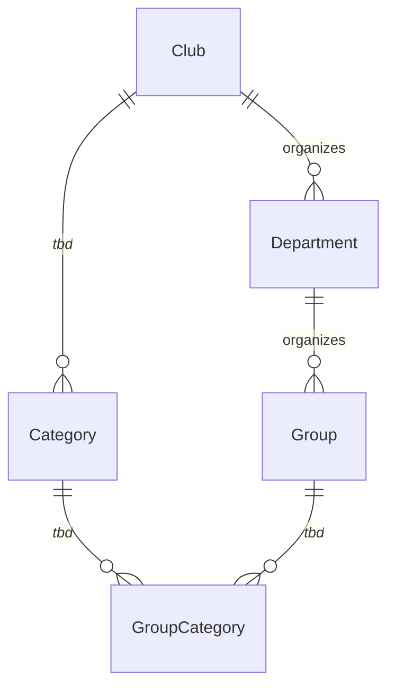
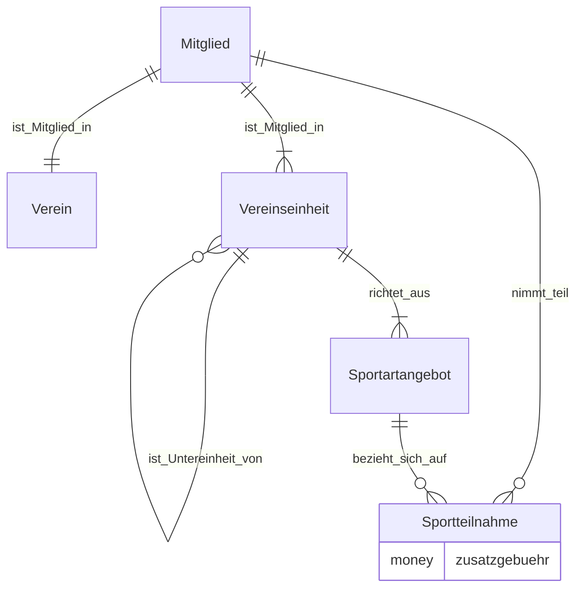

```mermaid
erDiagram
	Club ||--o{ Department : organizes
	Department ||--o{ Group : organizes
	Club ||--o{ Category : _tbd_
	Category ||--o{ GroupCategory : _tbd_
	Group ||--o{ GroupCategory : _tbd_
```



```mermaid
erDiagram
	Mitglied ||--|| Verein : ist_Mitglied_in
	Mitglied ||--|{ Vereinseinheit : ist_Mitglied_in
    Vereinseinheit ||--o{ Vereinseinheit : ist_Untereinheit_von
    Mitglied ||--o{ Sportteilnahme : nimmt_teil
	Sportartangebot ||--o{ Sportteilnahme : bezieht_sich_auf
	Sportteilnahme {
		money zusatzgebuehr
	}
	Vereinseinheit ||--|{ Sportartangebot : richtet_aus
```
<!-- 

```mermaid
classDiagram
	Mitglied "1..1" -- "0..*" Sportteilnahme : nimmt_teil
	Sportartangebot "1..1" -- "0..*" Sportteilnahme : bezieht_sich_auf
``` -->
